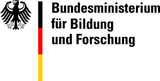

# VFRAME: Visual Forensics, Redaction, and Metadata Extraction

VFRAME is a computer vision framework designed for analyzing large media archives of images and videos. It includes a ModelZoo and a customizable plugin architecture to develop custom CLI tools. VFRAME is still under development and code is subject to major changes.


## Setup Conda or pip Environment

```
# Clone this repo
git clone https://github.com/vframeio/vframe

# Create Conda environment
conda env create -f environment-linux.yml  # Linux CPU (Another step required for GPU)

# Activate
conda activate vframe

# Make an alias to vframe cli (recommended)
alias vf="python /path/to/vframe/src/cli.py

# or
cd /path/to/vframe/
python src/cli.py
```

To run the GPU-accelerated scripts on more recent GPUs (including RTX 3080 Ti or 3090) install PyTorch nightly from <https://pytorch.org/>.


## Test Installation
```
# Show list of commands
vf

# Show list of image processing commands
vf pipe

# Show list of modelzoo commands
vf modelzoo
```


## ModelZoo
```
# List of modelzoo commands
vf modelzoo list

# Download a test model
vf modelzoo download -m coco

# Speed test model for 20 iterations
vf modelzoo benchmark -m coco --iters 20 --device -1  # use CPU
vf modelzoo benchmark -m coco --iters 20 --device 0 # use GPU 0, 1, etc...
```

Read more about the [ModelZoo](docs/modelzoo.md)


## Detect Objects
```
# detect objects using COCO model (replace "image.jpg" with your image)
vf pipe open -i image.jpg detect -m coco draw display
```

Read more about [object detection](docs/object-detection.md) and the [ModelZoo](docs/modelzoo.md)


## Redacting (Blurring) Faces
```
# Detect and blur faces in directory of images
vf pipe open -i input/ detect -m yoloface redact save-images -o output/
```

Read more about [redaction](docs/redaction.md)


## Batch Object Detection

Convert a directory of images or video to JSON summary of detections
```
vf pipe open -i $d detect save-json -o output/
```


## Road Map

- Add OCR
- Expand ModelZoo
- Improve detection inference performance


## Acknowledgments

VFRAME gratefully acknowledges support  from the following organizations and grants:


VFRAME received support from the NLNet Foundation and Next Generation Internet (NGI0) supported research and development of face blurring and biometric redaction tools during 2019 - 2021. Funding was provided through the NGI0 Privacy Enhancing Technologies Fund, a fund established by NLnet with financial support from the European Commission’s Next Generation Internet program. 


VFRAME development during 2019-2021 is being supported with a three-year grant by [Meedan](https://meedan.com) / Check Global. With this grant, we have developed tools to integrate computer vision in to Check's infrastructure, allowing computer vision to be deployed in the effort to verify breaking news, and carried out research and development of the synthetic data generation and training environment.




VFRAME development in 2018 and 2019 was supported with a grant from the German Federal Ministry of Education and Research (Bundesministerium für Bildung und Forschung) and the [Prototype Fund](https://prototypefund.de). This funding allowed VFRAME to research computer vision applications in human rights, prototype annotation and processing applications, implement a large-scale visual search engine, and prototype the synthetic 3D data generation environment.

Read more about supporting VFRAME on the website [vframe.io/about](https://vframe.io/about)